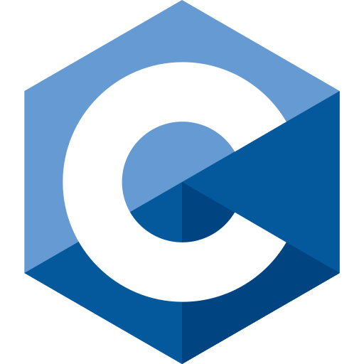

<h1 align="center">Hello! I'm Michael :)</h1>

  

  
  

 

I'm in my 3rd year of a 5.5 year degree studying Mechatronic Engineering (with Space) and Finance at the University of Sydney.

I'm studying, and am primarily more interested in, the engineering side of things such as automation, robotics, and embedded systems, as well as the implementation of these studies into high-tech manufacturing, minerals and mining, defence, space, and other tech industries. I still have 3+ years left in my degree, so I'm still exploring career and industry options.

This GitHub page is just an amalgamation of personal/team competition work, unit projects, and other random repos that I have made. The public repos, at least.

 

## Stack Experience

  
   C
  
  
  
  

## Currently Learning

  
  
  
  
  
  

## GitHub

  

  

  
  

